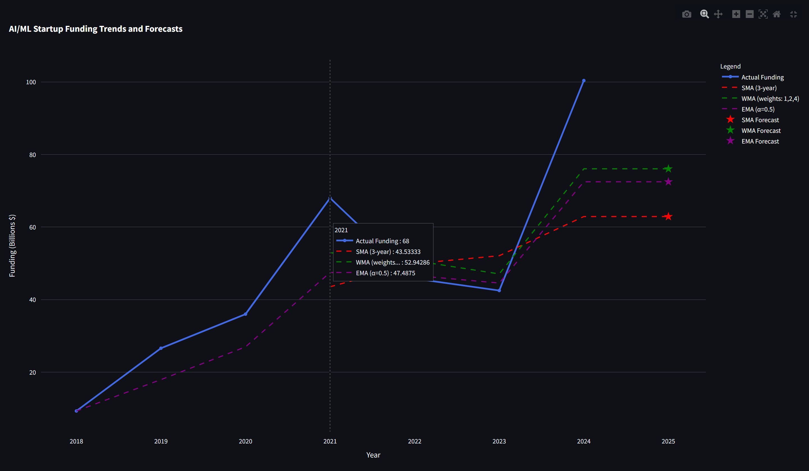
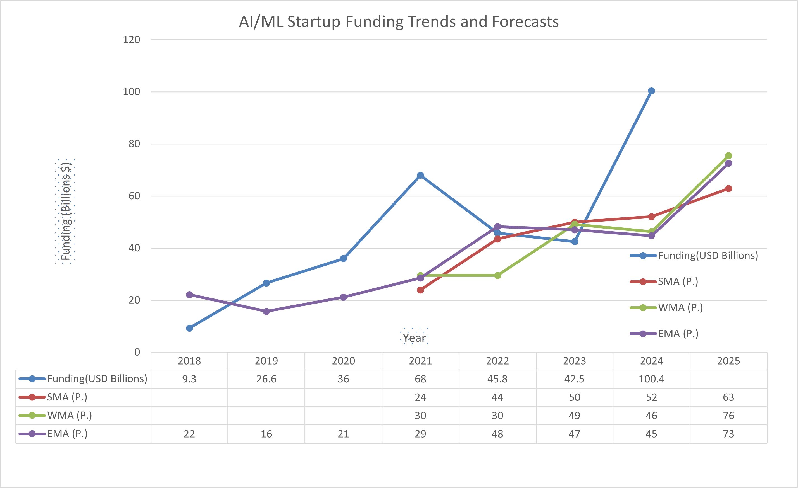

# 📈 AI/ML Startup Funding Forecast

## Overview
This project analyzes and forecasts AI/ML startup funding trends using three different moving average techniques: Simple Moving Average (SMA), Weighted Moving Average (WMA), and Exponential Moving Average (EMA). The interactive Streamlit application visualizes historical funding data from 2018-2024 and projects 2025 funding values.

[📄 View Technical Whitepaper](./whitepaper.md)

## 🚀 [Live Demo](https://ai-funding-predictor.streamlit.app)

## Background
Moving averages are powerful tools for identifying trends and making forecasts in time series data. In the rapidly evolving AI/ML startup landscape, understanding funding patterns can provide valuable insights for investors, founders, and analysts. This project demonstrates the practical application of different moving average techniques and evaluates their effectiveness in predicting future funding levels.


## 📊 Features

- Interactive dashboard showing AI/ML startup funding trends from 2018-2025
- Three different forecasting methods:
  - Simple Moving Average (SMA)
  - Weighted Moving Average (WMA)
  - Exponential Moving Average (EMA)
- Visual comparison of forecasting accuracy
- Step-by-step formula explanations with real-time calculations
- Error analysis with Mean Squared Error (MSE) metrics
- Adjustable parameters for customized forecasting
- Editable historical data for scenario analysis

## 🧮 Forecasting Methods

### Simple Moving Average (SMA)
```
SMA(t) = (a + b + c) / 3
```
Where a, b, and c represent the values from the 3 most recent years.

### Weighted Moving Average (WMA)
```
WMA(t) = (a×1 + b×2 + c×4) / (1 + 2 + 4)
```
Where more recent years get higher weights (oldest:1, middle:2, newest:4).

### Exponential Moving Average (EMA)
```
EMA(t) = Previous_EMA + α(Current_Value - Previous_EMA)
```
Where α is the smoothing factor between 0 and 1.

## ⚙️ Getting Started with Anaconda (Recommended)

Follow these steps to run the project using **Anaconda Prompt**:

1. **Install Anaconda**
   👉 [Download Anaconda](https://www.anaconda.com/download) and install it based on your operating system.

2. **Open Anaconda Prompt**

   * Search for "Anaconda Prompt" on your system and open it.

3. **Create a new conda environment**

   * This ensures all dependencies are isolated:

   ```bash
   conda create --name ai-funding-predictor python=3.8
   ```

   * Activate the newly created environment:

   ```bash
   conda activate ai-funding-predictor
   ```

4. **Install Streamlit**

   If you don’t have Streamlit installed yet, use the following:

   ```bash
   pip install streamlit
   ```

5. **Navigate to the Project Directory**

   ```bash
   cd path/to/AI-Funding-Predictor
   ```

6. **Install Required Dependencies**

   * Make sure all the required packages are installed:

   ```bash
   pip install -r requirements.txt
   ```

7. **Run the Streamlit App**

   Start the application by running:

   ```bash
   streamlit run app.py
   ```

8. **View in Browser**

   Your browser should automatically open and navigate to `http://localhost:8501`. If not, copy the URL from the prompt and paste it into your browser.

---

## 🧰 Installation (Without Anaconda)

### Prerequisites

* Python 3.6+
* pip
* (Optional) Virtual Environment

### Steps

1. **Clone the Repository**

   ```bash
   git clone https://github.com/binayakbartaula11/AI-Funding-Predictor.git
   cd AI-Funding-Predictor
   ```

2. **Create and Activate a Virtual Environment (Recommended)**

   * It's good practice to use a virtual environment to isolate dependencies:

   ```bash
   python -m venv venv
   ```

   * Activate the virtual environment:

   - **Windows:**

     ```bash
     venv\Scripts\activate
     ```
   - **macOS/Linux:**

     ```bash
     source venv/bin/activate
     ```

3. **Install Required Dependencies**

   Install the necessary Python packages:

   ```bash
   pip install -r requirements.txt
   ```

4. **Run the Streamlit App**

   After all dependencies are installed, run:

   ```bash
   streamlit run app.py
   ```

5. **View in Browser**

   Your browser should automatically navigate to `http://localhost:8501`. If it doesn’t, copy the URL from the terminal and paste it into your browser.

## 📦 Requirements

```
streamlit>=1.30.0
pandas>=2.0.0
numpy>=1.22.0
plotly>=5.18.0
```

## 🔍 How It Works

The application uses historical AI/ML startup funding data from 2018-2024 to predict funding for 2025 using three different moving average approaches:

1. **Data Processing**: Historical funding data is processed into a pandas DataFrame
2. **Moving Average Calculation**: Three methods (SMA, WMA, and EMA) are applied to the historical data
3. **Forecasting**: The most recent calculated average is used as the forecast for 2025
4. **Error Analysis**: Each method's historical accuracy is evaluated using Mean Squared Error
5. **Visualization**: Interactive Plotly charts display both historical data and forecasts

### 📉 Forecast Performance
The application automatically calculates and compares the historical accuracy of each method using Mean Squared Error (MSE). This helps identify which forecasting approach has been most reliable for this specific dataset across the analysis period.

### 🔑 Key Insights
- The three moving averages effectively smooth out fluctuations in the funding data
- Each method demonstrates different responsiveness to sudden changes in funding levels
- The performance ranking provides data-driven guidance on which method to trust for future forecasts
- The forecast values for 2025 are clearly visualized alongside historical trends

## 🧩 Implementation Approach

This code intentionally uses a hybrid approach combining both package functions and manual implementations:

- **Package-based implementations:**
  - **SMA**: Uses pandas' built-in `rolling().mean()` function
  - **Data handling**: Leverages pandas DataFrames for efficient data processing
  - **Visualization**: Uses Plotly's graphing libraries for interactive charts

- **Manual implementations:**
  - **WMA**: Custom algorithm that applies specific weights (1,2,4) to recent values
  - **EMA**: Step-by-step calculation that clearly shows how each EMA value builds on previous ones
  - **Error calculations**: Manually calculated for transparency and educational purposes

This mixed approach was chosen to balance efficiency with educational value, making the mathematical concepts behind forecasting methods more transparent to users while still leveraging optimized libraries where appropriate.

## 🧪 Error Analysis

The app automatically calculates the Mean Squared Error (MSE) for each forecasting method based on historical data, helping users determine which method has been most reliable for this particular dataset.

## 📋 Screenshot

Here are two visualizations:

1. **Streamlit Forecasting Visualization**  
   An interactive chart from the Streamlit app showing the funding trends and forecasts.

   

2. **Excel Output Visualization**  
   A screenshot of the Excel file showing the calculated forecasted funding values alongside historical data.

   


## 🔮 Future Work

Potential areas for future exploration include:
- Incorporating additional forecasting methods (ARIMA, Prophet, etc.)
- Adding confidence intervals to the forecasts
- Integrating real-time data feeds from VC funding databases
- Expanding analysis to include sector-specific funding trends
- Developing a geographical breakdown of funding patterns

## 🎛️ Customization

- Adjust the EMA smoothing factor using the slider in the sidebar
- Toggle between default data and custom inputs
- Enter your own historical funding values for scenario analysis
- Compare multiple forecasting scenarios side by side

## 🗂️ Data Sources

The default dataset is based on aggregated public information about AI/ML startup funding from 2018-2024, obtained from [Perplexity Research](https://www.perplexity.ai/search/please-provide-structured-data-TuW86UxiRCykQcOQAXFIUg). Users can modify this data or input their own for custom analysis.

## 📄 License

This project is licensed under the [MIT License](https://opensource.org/licenses/MIT).

## 📧 Contact

**Binayak Bartaula**  
- **Email:** [binayak.221211@ncit.edu.np](mailto:binayak.221211@ncit.edu.np)  
- **LinkedIn:** [linkedin.com/in/binayakbartaula](https://linkedin.com/in/binayakbartaula)
- **Twitter:** [@BartaulaBinayak](https://X.com/BartaulaBinayak)  
    > **Project Link:** [https://github.com/binayakbartaula11/AI-Funding-Predictor](https://github.com/binayakbartaula11/AI-Funding-Predictor)

---
*This project was developed as part of coursework at Nepal College of Information Technology, affiliated with Pokhara University.*
